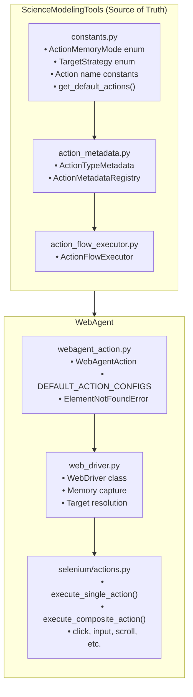
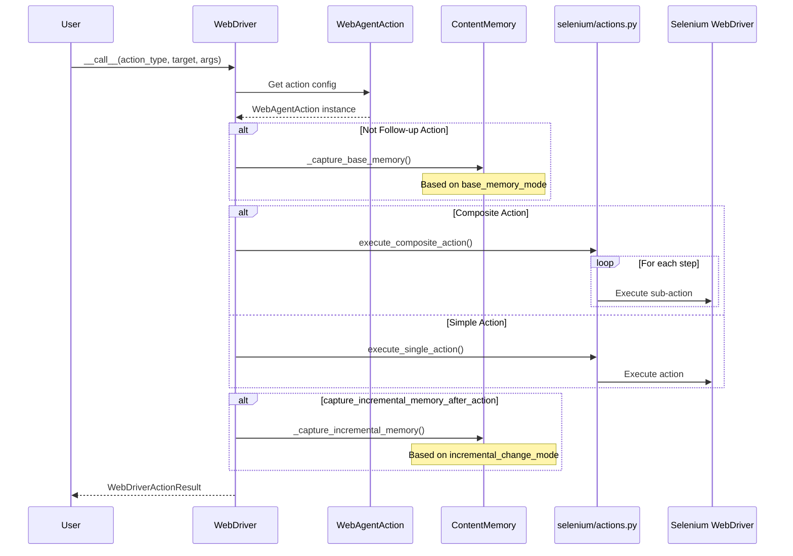
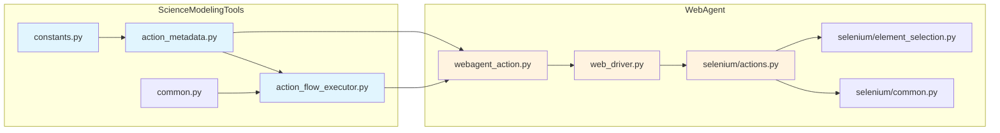
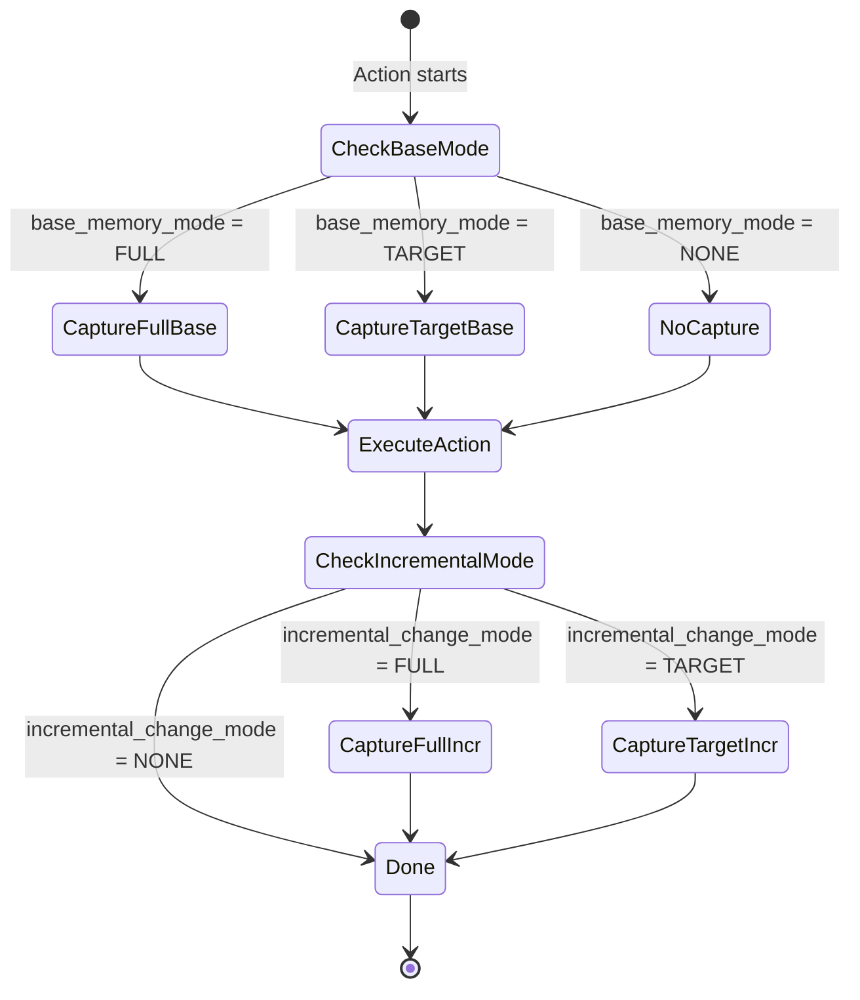
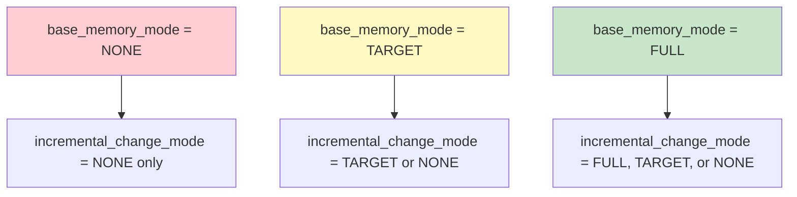
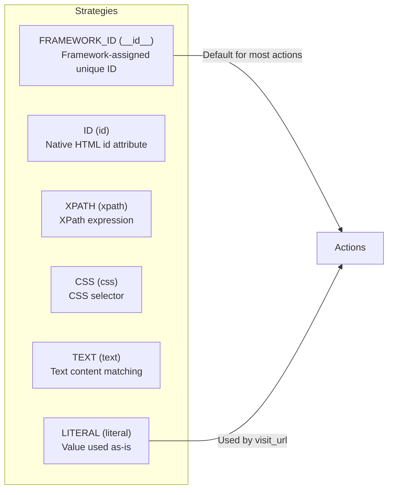
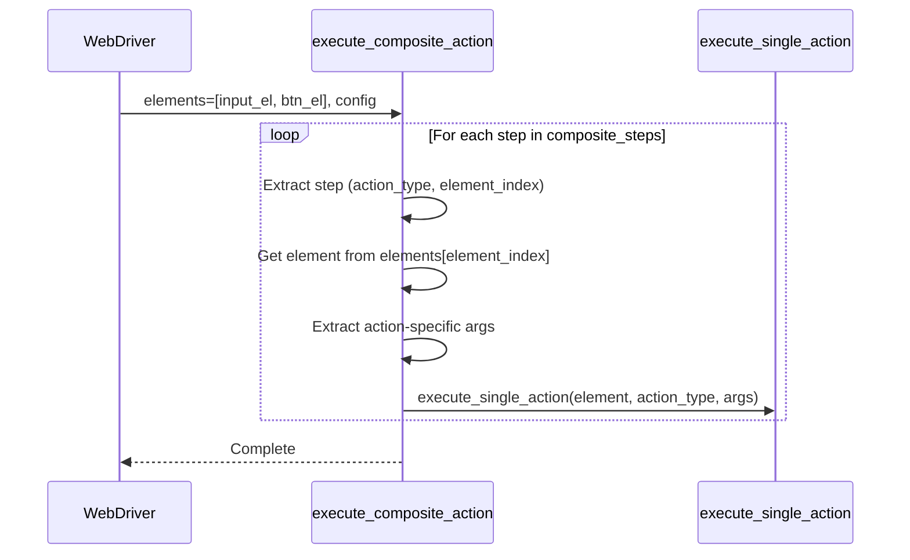

# WebAgent Action Schema Integration

This package provides WebAgent-specific integration with the action sequence execution system from ScienceModelingTools. It enables UI automation workflows to be defined as JSON documents and executed via WebDriver.

## Architecture Overview



## Data Flow: From Schema to Execution



## Module Dependency Graph



## Memory Mode State Machine



## Execution Flow Details

### 1. Action Configuration Loading

```python
# In webagent_action.py - loads from ScienceModelingTools
registry = ActionMetadataRegistry()  # Loads defaults from constants.py
DEFAULT_ACTION_CONFIGS = {
    'click': WebAgentAction(name='click', base_memory_mode=NONE, ...),
    'scroll': WebAgentAction(name='scroll', base_memory_mode=TARGET, ...),
    'visit_url': WebAgentAction(name='visit_url', base_memory_mode=NONE, ...),
    ...
}
```

### 2. WebDriver Initialization

```python
# In web_driver.py
class WebDriver:
    def __init__(self, action_configs=None):
        self._action_configs = action_configs or DEFAULT_ACTION_CONFIGS
```

### 3. Action Execution via __call__

```python
# WebDriver.__call__() flow:
def __call__(self, action_type, action_target, action_args, ...):
    # 1. Get action config
    action_config = self._action_configs.get(action_type)
    
    # 2. Memory capture (based on action_config.base_memory_mode)
    if not action_is_follow_up:
        self._capture_base_memory(action_config, element, action_memory)
    
    # 3. Execute action
    if action_config.composite_action:
        execute_composite_action(driver, elements, action_config, ...)
    else:
        self.execute_single_action(element, action_type, action_args, ...)
    
    # 4. Incremental memory capture
    if action_config.capture_incremental_memory_after_action:
        self._capture_incremental_memory(action_config, element, action_memory)
```

### 4. Action Dispatch in selenium/actions.py

```python
def execute_single_action(driver, element, action_type, action_args, ...):
    if action_type == 'click':
        click_element(driver, element, ...)
    elif action_type == 'input_text':
        input_text(driver, element, **action_args)
    elif action_type == 'scroll':
        scroll_element(driver, element, **action_args)
    elif action_type == 'visit_url':
        open_url(driver, element, ...)  # element is URL string
    ...
```

## Memory Modes (ActionMemoryMode)

Memory modes control HTML capture for tracking UI changes:

| Action | base_memory_mode | incremental_change_mode | Rationale |
|--------|-----------------|------------------------|-----------|
| click | NONE | NONE | Click doesn't predictably change content |
| input_text | NONE | NONE | Text input doesn't change visible structure |
| scroll | TARGET | TARGET | Scroll reveals new content in target area |
| visit_url | NONE | NONE | Navigation replaces page entirely |
| wait | NONE | NONE | Wait doesn't change content |

### Memory Mode Constraints



## Default Actions

| Action | Default Strategy | Memory Mode | Description |
|--------|-----------------|-------------|-------------|
| click | FRAMEWORK_ID | NONE/NONE | Click on a UI element |
| input_text | FRAMEWORK_ID | NONE/NONE | Input text into a field |
| append_text | FRAMEWORK_ID | NONE/NONE | Append text to existing content |
| visit_url | LITERAL | NONE/NONE | Navigate to a URL |
| scroll | FRAMEWORK_ID | TARGET/TARGET | Scroll an element or page |
| scroll_up_to_element | FRAMEWORK_ID | TARGET/TARGET | Scroll until element visible |
| wait | None | NONE/NONE | Wait for specified duration |
| input_and_submit | FRAMEWORK_ID | NONE/NONE | Composite: input + click |

## Target Resolution Strategies



| Strategy | Value | Description |
|----------|-------|-------------|
| FRAMEWORK_ID | `__id__` | Framework-assigned unique ID (default) |
| ID | `id` | Native HTML id attribute |
| XPATH | `xpath` | XPath expression |
| CSS | `css` | CSS selector |
| TEXT | `text` | Text content matching |
| LITERAL | `literal` | Value used as-is (for URLs) |

## Composite Actions



Composite actions decompose into multiple sub-actions:

```python
# input_and_submit = input_text + click
action_config.composite_steps = [
    ('input_text', 0),  # First element
    ('click', 1),       # Second element
]

# Usage: target contains space-separated element IDs
{
    "type": "input_and_submit",
    "target": "search-input submit-button",
    "args": {"text": "query"}
}
```

## Package Contents

- `__init__.py` - Re-exports from ScienceModelingTools + WebAgent-specific
- `webagent_action.py` - WebAgentAction class, DEFAULT_ACTION_CONFIGS, ElementNotFoundError
- `README.md` - This documentation

## Usage Examples

### Direct WebDriver Usage

```python
from webaxon.automation.web_driver import WebDriver

driver = WebDriver(headless=True)
driver.open_url("https://example.com")

# Execute action via __call__
result = driver(
    action_type='click',
    action_target='submit-button',  # Element ID
    action_args={}
)
```

### With ActionFlowExecutor

```python
from webaxon.automation.schema import (
    load_sequence,
    ActionFlow,
    ActionMetadataRegistry,
)
from webaxon.automation.web_driver import WebDriver

driver = WebDriver(headless=True)
sequence = load_sequence("actions.json")

executor = ActionFlow(
    action_executor=driver,
    action_metadata=ActionMetadataRegistry()
)
result = executor.execute(sequence)
```

## Import Hierarchy

```python
# From ScienceModelingTools (source of truth)
from agent_foundation.automation.schema import (
    ActionMemoryMode,  # Enum: FULL, TARGET, NONE
    TargetStrategy,  # Enum: FRAMEWORK_ID, ID, XPATH, CSS, TEXT, LITERAL
    ActionTypeMetadata,  # Base Pydantic model
    ActionMetadataRegistry,  # Registry with defaults
    ActionFlow,  # Sequence executor
)

# From WebAgent (extends ScienceModelingTools)
from webaxon.automation.schema import (
    WebAgentAction,  # Extends ActionTypeMetadata
    DEFAULT_ACTION_CONFIGS,  # Pre-loaded action configs
    ActionMemoryMode,  # Re-exported
    ElementNotFoundError,  # Selenium-specific exception
)
```

## Testing

```bash
pytest WebAgent/test/webaxon/automation/schema/ -v
```
